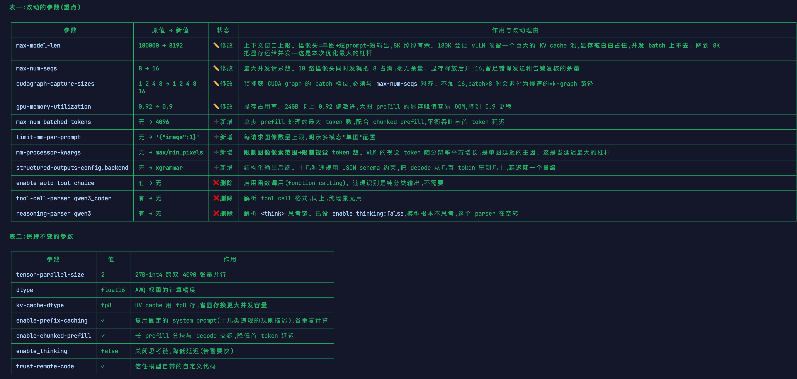

nohup python -m vllm.entrypoints.openai.api_server \
 --model /data/models/Qwen3.6-27B-AWQ-INT4 \
 --served-model-name chaos3.6-27b \
 --host 0.0.0.0 \
 --port 8000 \
 --tensor-parallel-size 2 \
 --gpu-memory-utilization 0.92 \
 --max-model-len 180000 \
 --max-num-seqs 16 \
 --dtype float16 \
 --kv-cache-dtype fp8 \
 --enable-prefix-caching \
 --enable-chunked-prefill \
 --mm-processor-kwargs '{"min_pixels":200704,"max_pixels":1003520}' \
 --limit-mm-per-prompt '{"image":1}' \
 --cudagraph-capture-sizes 1 2 4 8 16 \
 --enable-auto-tool-choice \
 --tool-call-parser qwen3_coder \
 --reasoning-parser qwen3 \
 --default-chat-template-kwargs '{"enable_thinking": false}' \
 --trust-remote-code \

> /root/vllm_chaos36_27b_awq.log 2>&1 &

关键改动说明

优化逻辑串起来看
可以归纳为四个方向:

1. 把显存还给并发:max-model-len 180K→8K,腾出 KV cache 空间 → max-num-seqs 8→16;
2. 砍掉单图延迟:mm-processor-kwargs 限图像 token + structured-outputs 限输出 token;
3. 去掉无关开销:三个 Agent 参数(tool-call / reasoning / auto-tool-choice)对纯分类任务纯属空转;
4. 稳定性兜底:gpu-memory-utilization 0.92→0.9 防 OOM。

# 按之前测算,这套配置下 10 路错峰发送,每路可稳定做到 3–5 秒一帧。

先把 105 类分析完,我得到一个重要且需要修正预期的结论:这 105 类里,能用 YOLO 独立闭环的只有不到 10 类,绝大多数(85%+)必须靠 VLM 判断。所以这套体系的真实定位是 VLM 主力 + YOLO 当触发器和加速器,不是简单的"YOLO 高频 + VLM
复核"。下面整套架构是按这个判断设计的。

一、105 类分档(决定走哪个引擎)

按"识别特征"分四档:

┌──────┬──────────────────────┬─────────────────────────────────────────────┬──────────────────────────────────────────────────────────────────────────────────────────────────────┬──────────┐
│ 档位 │ 引擎 │ 特征 │ 代表告警 │ 数量(估) │
├──────┼──────────────────────┼─────────────────────────────────────────────┼──────────────────────────────────────────────────────────────────────────────────────────────────────┼──────────┤
│ A 档 │ YOLO 独立闭环 │ 标准、明确的视觉目标,检测"有无"即可判定 │ 安全帽未戴(1)、反光背心(3)、灭火器存在(14)、人数计数(43/58)、人员入侵禁区(6) │ ~8–10 │
├──────┼──────────────────────┼─────────────────────────────────────────────┼──────────────────────────────────────────────────────────────────────────────────────────────────────┼──────────┤
│ B 档 │ YOLO 粗检 + VLM 裁判 │ 细粒度特征、姿态、空间关系、距离/角度 │ 下颚带未系(2)、打电话(8)、吸烟(7)、气瓶卧放(17)、间距不足(19/20/86)、安全带系挂(63–65)、歪拉斜吊(69) │ ~60–65 │
├──────┼──────────────────────┼─────────────────────────────────────────────┼──────────────────────────────────────────────────────────────────────────────────────────────────────┼──────────┤
│ C 档 │ VLM 独占(周期扫描) │ "缺失检测"——该有却没有,语义判断 │ 警戒线缺失(9)、标识缺失(10)、围栏缺失(11)、盖板(12)、验收牌(45)、护栏缺失(48)、风向标(98) │ ~25–28 │
├──────┼──────────────────────┼─────────────────────────────────────────────┼──────────────────────────────────────────────────────────────────────────────────────────────────────┼──────────┤
│ D 档 │ 多帧/时序 │ 需要动作或时间序列才能判定,单帧截图无法覆盖 │ 抛物(37)、随吊物升降(78)、推动脚手架(54)、吊篮晃动(60)、睡岗(5)、旋转半径站人(90) │ ~6–8 │
└──────┴──────────────────────┴─────────────────────────────────────────────┴──────────────────────────────────────────────────────────────────────────────────────────────────────┴──────────┘

结论:B+C+D 合计 90+ 类都依赖 VLM。YOLO 的真正价值不在"判定",而在下面两件事——这是混合架构省钱的根本。

二、核心设计:场景驱动的检查清单(不是每帧查 105 类)

这是整套架构的关键。绝对不要每张图都让 VLM 查 105 类——输出 token 会爆炸,准确率也会被稀释。

正确做法:YOLO 先判"这是什么作业场景",VLM 只查该场景的子集。8 个场景对应你表里的大类:

检测到 电焊/气瓶/明火/焊钳 → 加载「动火作业清单」(14–27,共14项)
检测到 人孔/井口/受限空间入口 → 加载「受限空间清单」(28–35,共8项)
检测到 脚手架/梯子/高处/安全网 → 加载「高处作业清单」(36–65,共30项)
检测到 吊车/吊臂/吊物 → 加载「吊装作业清单」(66–78,共13项)
检测到 配电箱/电缆/电焊机 → 加载「临时用电清单」(79–85,共7项)
检测到 基坑/挖掘机/堆土 → 加载「动土作业清单」(86–100,共15项)
检测到 法兰拆卸/管道 → 加载「盲板抽堵清单」(101–105,共5项)
其余画面(有人无特殊作业) → 加载「综合管理清单」(1–13,共13项)

这样 VLM 每次只面对 5–30 个检查项,token 可控、准确率高,且不同场景可设不同频率(动火/高处/吊装是高危,高频;综合管理低频)。

三、端到端数据流

┌─────────────── 采集层(边缘端) ───────────────┐
│ 摄像头×10 (RTSP) → 抽帧(3–5 fps) → 运动检测 │
│ ↓ 过滤空场景(无人/无变化直接丢弃,省 60%+ 调用)│
└───────────────────────┬───────────────────────┘
↓
┌─────────────── YOLO 前置层(边缘端,5–10 fps) ─┐
│ ① 基础目标检测:人/安全帽/反光衣/灭火器/气瓶/ │
│ 梯子/脚手架/吊车/配电箱/基坑… + 人数/位置 │
│ ② A 档明确违规 → 直接出告警(不经过 VLM) │
│ ③ 产出场景标签:判断画面属于哪些作业场景 │
└───────────────────────┬───────────────────────┘
↓
┌─────────────── 路由决策 ─────────────────────┐
│ 有作业场景 或 疑似违规? │
│ 是 → 触发 VLM(带上场景清单 + YOLO 目标提示) │
│ 否 → 跳过 │
└───────────────────────┬───────────────────────┘
↓
┌─────────────── VLM 裁判层(中心 2×4090) ───────┐
│ 输入:图像 + 该场景检查项清单 + 结构化 schema │
│ 输出:命中的违规项(id/置信度/位置框/判定依据) │
└───────────────────────┬───────────────────────┘
↓
┌─────────────── 告警后处理 ───────────────────┐
│ 去重窗口(同类同区域 30–60s 不重复) │
│ → 合并多路 → 置信度过滤 → 抑制 → 工单/通知/大屏│
└───────────────────────────────────────────────┘

四、各层频率与触发策略

┌───────────────────────────────────────────┬─────────────────────────────────┬────────────────────────────────────────┐
│ 层 / 场景 │ 频率 │ 说明 │
├───────────────────────────────────────────┼─────────────────────────────────┼────────────────────────────────────────┤
│ YOLO 前置 │ 每路 5–10 fps │ 边缘端实时跑,产出目标+场景标签+A档告警 │
├───────────────────────────────────────────┼─────────────────────────────────┼────────────────────────────────────────┤
│ VLM · 高危场景(动火/高处/吊装) │ 每 2–3 秒/路 │ YOLO 检测到场景在场时触发 │
├───────────────────────────────────────────┼─────────────────────────────────┼────────────────────────────────────────┤
│ VLM · 综合管理(安全帽/反光衣/打电话/吸烟) │ 每 3–5 秒/路,或 YOLO 疑似时触发 │ 兼顾时效与成本 │
├───────────────────────────────────────────┼─────────────────────────────────┼────────────────────────────────────────┤
│ VLM · 缺失类(警戒线/标识/围栏等 C 档) │ 每 15–30 秒/路 │ 设施不会频繁变化,低频即可 │
├───────────────────────────────────────────┼─────────────────────────────────┼────────────────────────────────────────┤
│ VLM · 时序类(D 档) │ 事件触发,抓 3–5 帧短序列送 VLM │ 见下一节 │
└───────────────────────────────────────────┴─────────────────────────────────┴────────────────────────────────────────┘

按这个策略,2×4090 扛 10 路是充裕的——因为大部分算力被"空场景过滤 + 场景驱动"省下来了,真正送到 27B 的请求量远低于"10 路全时高频"。

五、D 档时序类告警的盲区(必须正视)

这是定期截图架构天然覆盖不了的。抛物、随吊物升降、推动脚手架、吊篮晃动、长时间睡岗——这些靠单帧判断不了。两个可行对策,你选一个:

- 方案甲(轻量):YOLO 检测到疑似事件(如高空有物体掉落轨迹、吊篮明显倾斜),触发后抓 3–5 帧连续短序列打包送 VLM,让 VLM 看动作序列判断。
- 方案乙(纯边缘):边缘端做运动检测/轨迹分析预处理,直接出 D 档告警,不走 VLM。

诚实说:D 档这 6–8 类做不到"截图轮询"那种确定性,只能做到"事件触发后复核"。如果不接受这个折中,部分 D 档需要专门的视频分析管线,成本会上去。

六、YOLO ↔ VLM 的数据契约

这是两层能解耦协作的关键:

YOLO 输出(发给 VLM 作为上下文,可显著降 token、提准确率):
{
"scene": ["动火作业", "高处作业"],
"objects": [
{"cls": "person", "box": [x,y,w,h], "has_helmet": false},
{"cls": "gas_cylinder", "box": [...]},
{"cls": "welder", "box": [...]}
]
}

VLM 请求:图像 + 系统提示(注入对应场景的检查项清单 + 上述 YOLO 上下文)+ response_format 的 JSON schema。

VLM 输出:
{
"violations": [
{"id": 16, "name": "气瓶无防震圈/瓶帽", "confidence": 0.82, "box": [...], "basis": "左侧气瓶瓶口未见保护帽"}
]
}

▎ 注意:把 YOLO 的目标框喂给 VLM 是可选优化。好处是省 token(不用 VLM 重新定位);代价是要维护两套模型对齐。一期可以先不喂,VLM 自己看图,跑通后再加。

七、告警后处理(避免告警风暴)

- 去重窗口:同类违规(如"未戴安全帽")在同一区域,30–60 秒内只报一次或降级为"持续中",否则每帧都报会刷屏。
- 置信度阈值:VLM 置信度低于阈值的转人工复核或丢弃,别直接告警。
- 跨路合并:相邻摄像头拍到同一违规(如交叉作业无隔离)合并为一条。

八、需要你拍板的决策点

这几项会直接决定落地形态,你确认后我可以继续出 YOLO 模型清单、VLM 的 prompt 模板和检查项清单的完整 JSON:

1. 边缘端算力:YOLO 跑在哪?摄像头侧小盒子(Jetson 级)、独立边缘服务器、还是和 4090 同机跑?这决定 YOLO 的帧率和模型大小。
2. D 档时序类:本期是否纳入?纳入的话走方案甲(多帧送 VLM)还是乙(边缘端预处理)?
3. 告警出口:对接工单系统、消息推送、还是仅大屏展示?影响后处理层设计。
4. 场景标签来源:用 YOLO 的目标组合推断场景,还是单独训一个轻量场景分类器?(前者零额外训练,后者更稳)

---

我的建议:一期先用 YOLO 目标组合推断场景 + 不喂框给 VLM + D 档走方案甲(多帧复核),这是能最快跑通、又保留升级空间的最小可用架构。要的话我下一步把每个场景的检查项清单 JSON 和 VLM 的 system prompt 模板写出来,直接能接到你那个 27B 服务上。
